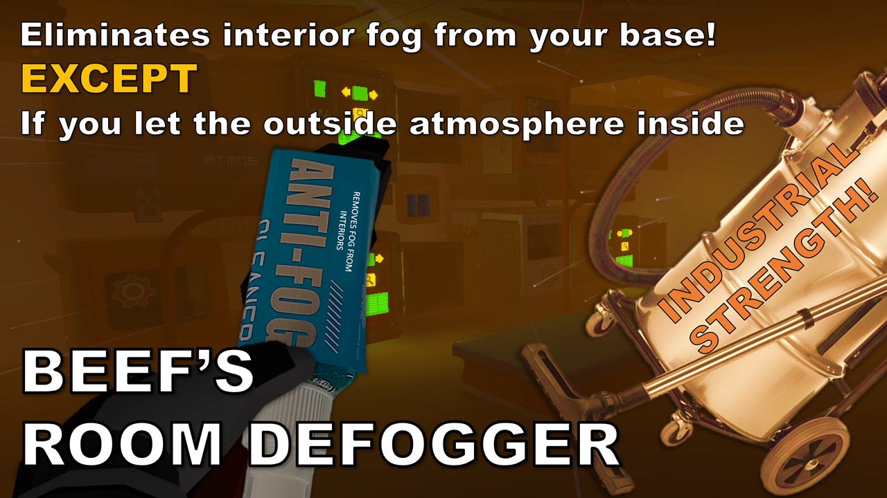

# Beef's Room Defogger

Removes fog and atmospheric scattering in sealed, pressurized rooms while maintaining normal fog effects outdoors.

## Features

- Fog outside but not inside
- Fog transitions based on room sealing and atmospheric composition
- Distinguishes between sealed rooms, venting rooms, and outdoor areas
- Configurable fog buffer distances and adjustment speeds
- Improves storm fog and particle effects for terrain-walled rooms
- Dims the sun during appropriate storms

## Requirements

**WARNING:** This is a StationeersLaunchPad Plugin Mod. It requires BepInEx to be installed with the StationeersLaunchPad plugin.

See: [https://github.com/StationeersLaunchPad/StationeersLaunchPad](https://github.com/StationeersLaunchPad/StationeersLaunchPad)

## Installation

1. Ensure you have BepInEx and StationeersLaunchPad installed.
2. Install from the Steam Workshop, or manually place the DLL file into your `/BepInEx/plugins/` folder.

## Usage

Configuration available through StationeersLaunchPad config or BepInEx config files.

## Changelog

>### Version 1.1.2
> - Fixed bug causing error in coroutine
> - Stopped logging room updates
> - Added scaling for the update popup

>### Version 1.1.1
> - Disabled storm particle changes (fog effect remains stays) in multiplayer until replication is resolved

>### Version 1.1.0
>- Improved handling of terrain-walled rooms during storms. Now your closed-in/pressurized tunnels won't get storm particles
>- Overrides the storm fog effect now as well
>- Added sun dimming for storms (minus solar storm of course)

>### Version 1.0.0
>- Detect and adjust fog based on indoors or outdoors
>- Determines if a room is sealed or venting
>- Traverse and updates cache of nearby rooms to propagate effect
>- Compares internal vs external atmo for interpolation in sealed but not cleaned up rooms
>- Config options added

## Roadmap

## Source Code

The source code is available on GitHub:
[https://github.com/TheRealBeef/Beefs-Stationeers-Room-Defogger](https://github.com/TheRealBeef/Beefs-Stationeers-Room-Defogger)